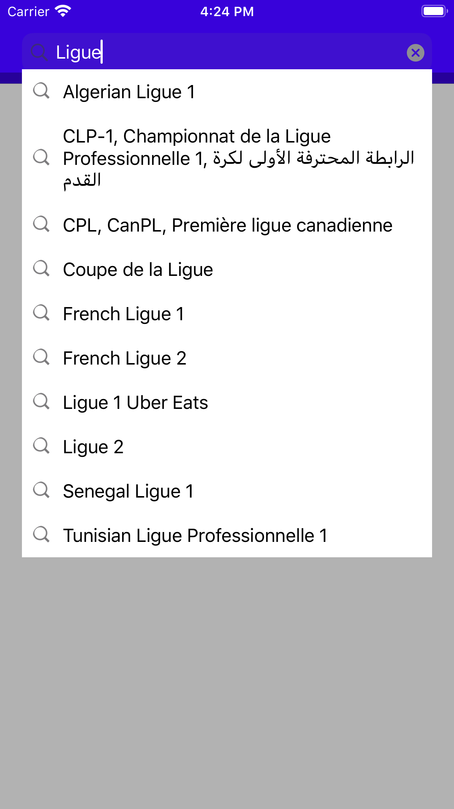
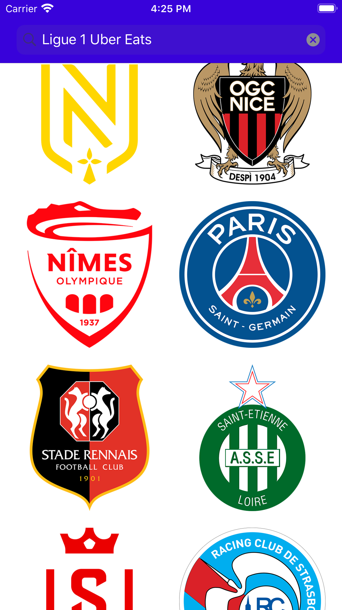

# Exercice Mobile : SoccerTeams

## Screenshots (TODO)

Home View - Search             |  Home View - Teams           |  Players View
:-------------------------:|:-------------------------:|:-------------------------:
  |    |  

## Install

<details>
<summary>Install SwiftGen via <strong>Homebrew</strong> <em>(system-wide installation)</em></summary>

#### To install SwiftGen via [Homebrew](http://brew.sh), simply use:

```
brew install swiftgen
```

---
</details>
<details>
<summary>Install SwiftLint via <strong>Homebrew</strong> <em>(system-wide installation)</em></summary>

#### To install SwiftGen via [Homebrew](http://brew.sh), simply use:

```
brew install swiftlint
```

---
</details>
<details>
<summary>Install Slather via <strong>Ruby</strong></summary>

TODO

---
</details>

Open `FootballTeams.xcodeproj`, then run.

## Unit testing

I use Slather to generate coverage report in HTML format.
